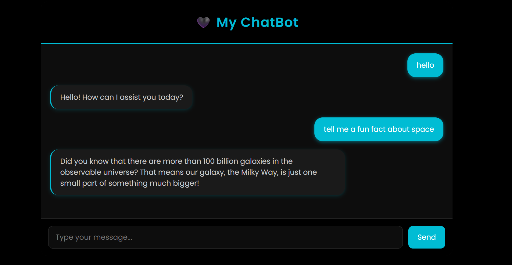
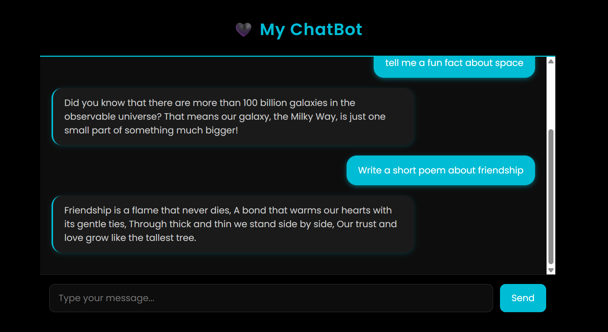

# 🧠 AI Chatbot (Django + LLM)

A web-based AI chatbot built with Django that integrates with local or cloud LLMs to generate conversational responses. Beautiful dark-themed UI, easy to customize, and supports local models with Ollama.

---

## 🌟 Features

✅ Django-powered web app  
✅ Dark-themed chat interface  
✅ Integration with local or cloud LLMs  
✅ Responsive design with modern fonts  
✅ Easy to extend and customize

---

## 📸 Screenshots

### ✅ Chat in action

---

## ⚙️ Tech Stack

- Python 3
- Django
- Bootstrap
- JavaScript (AJAX)
- Ollama (for local LLMs)
- OpenAI / Anthropic APIs (for cloud LLMs)

---

